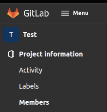
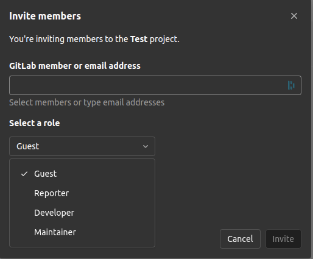

# prosjekt

| Gruppe | (bytt med nummer) |
| ------ | -------- |
| Fornavn | Etternavn |
| Fornavn | Etternavn |
| Fornavn | Etternavn |

Prosjekt for elever på VGS.


Målet med oppgaven er å lage et program som henter ut data og setter inn data i en database.
Databasen skal inneholde tre forskjellige tabeller. Databasen og tabellene skal settes opp slik at de følger kravene til [3NF](https://en.wikipedia.org/wiki/Third_normal_form).

Programmet som kommuniserer med databasen kan skrives i Pyton eller JavaScript - Dette velger gruppen selv.


## **Huskeliste av oppgaver**

1. [ ] [Lag fork av dette repositoryet](/README.md#fork-prosjekt)
2. [ ] [Legg til gruppemedlemmer i repo som utviklere.](/README.md#legge-til-gruppemedlemmer-i-repository)
3. [ ] [Sett opp .gitignore for IDE filer.](/README.md#sett-opp-.gitignore-for-IDE-filer)
4. [ ] [~~Endre på branch regler - Ikke lov å "pushe" til master branch.~~](/README.md#endre-branch-regler)
5. [ ] [Lag plan for database struktur.](/README.md#lag-plan-for-database-struktur)
6. [ ] [Lag plan for prosjekt/program struktur.](/README.md#lag-plan-for-prosjekt/programm-struktur)


---

## Fork prosjektet

For å forke prosjektet så trykker du på **fork** som ligger oppe til høyre på denne siden (repository root directory).

Sett **Project name** til å være hydro_reviews_[+gruppenummer] (f.ex: hydro_reviews_01) og sett deretter prosjektet til å være privat.


---

## Legge til gruppemedlemmer i repository 
- Oppe i venstre hjørne av GitLab finner du **"Members"** under **"Project Information"** kategorien.
- Trykk deretter på **"Invite members"** nær toppen på høyre siden av **"Members"** tabben.



- Inviter gruppemedlemmene som **Maintainer** eller **Developer**, inviter også stian.pedersen1996 som **Reporter**.



Etter dette er gjort så legger dere inn alle gruppe medlemmene inn på toppen av denne README.md fila.

---

## Sett opp .gitignore for IDE filer

For å hindre at autogenererte filer som er forskjellige for alle på gruppen, er det nødvendig å sette opp et filter som utelokker disse i fra å bli lastet opp på deres repository.

Bildet under viser et prosjekt der .gitignore filen er tom. IDEen har generert masse filer som vi ikke ønsker å laste opp til git


I dette tilfellet er vi kun interessert i å laste opp filene som de andre på gruppen trenger så vi setter opp **.gitignore** fila til å ignorere de uønskede filene:
```.gitignore
#Merk at alt som slutter med "/" er en mappe, og inneholder mange andre filer og mapper.
#Ved å ekskludere ytterste mappen, ekskluderer du alt innenfor også.
.gradle/
.idea/
gradle/
local.properties
```


## ~~Endre branch regler~~

Kan ikke brukes på gratis versioner

## Lag plan for prosjekt/program struktur

## Lag plan for database struktur

Lag en UML tenging av tabeller og hvilken data som skal inn i tabellene, sett deretter opp relasjoner imellom tabellene, slik at samme dataen ikke blir lagret minst mulig ganger. 


### Databasen skal inneholde:
 - Bruker: 
    - Navn
    - Nummer
    - E-Mail
 - Drikke
    - Merke/produsent
    - Type
    - Pris
    - Sukkerinnhold
    - andre detaljer(optional)
  - Review
    - terningskast
    - Review
    - Forfatter
    - Hva er det/type og merke


