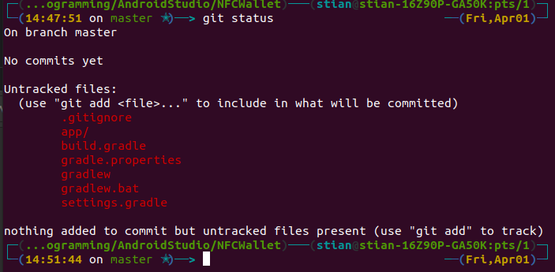
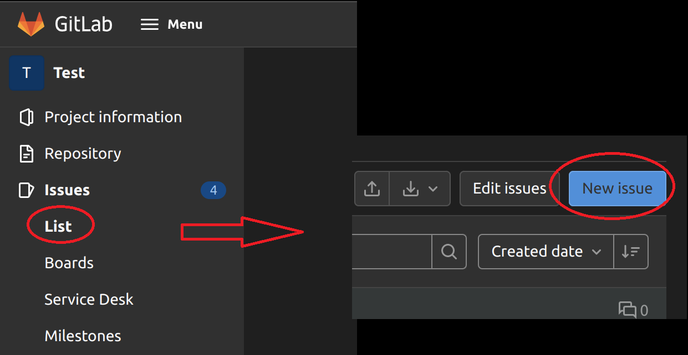
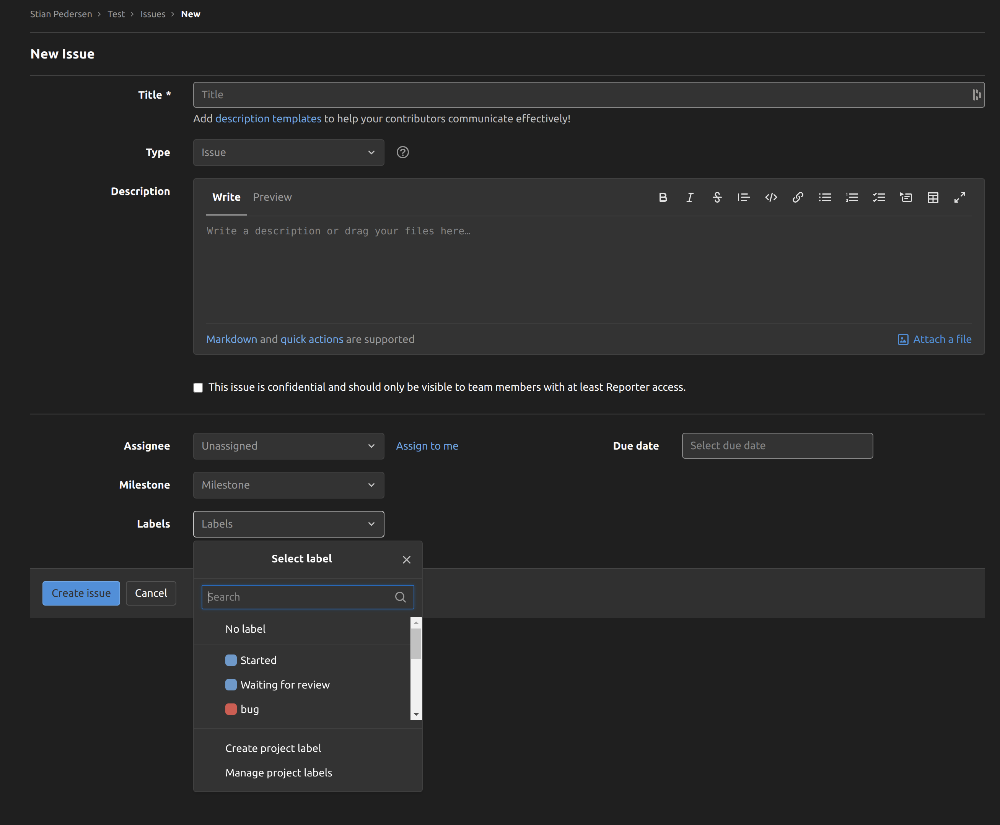

# prosjekt


| Gruppe | (bytt med nummer) |
| ------ | -------- |
| Fornavn | Etternavn |
| Fornavn | Etternavn |
| Fornavn | Etternavn |

---
## Introduksjon
Prosjekt for elever på VGS.

Målet med oppgaven er å lage en database og et program som henter ut og setter inn data i denne databasen. 

---

# Oversikt

## Huskeliste av oppgaver

- [ ] [Lag fork av dette repositoryet](/README.md#fork-prosjektet)
- [ ] [Legg til gruppemedlemmer i repo som utviklere.](/README.md#legge-til-gruppemedlemmer-i-repository)
- [ ] [Sett opp .gitignore for IDE filer.](/README.md#sett-opp-.gitignore-for-IDE-filer)
- [ ] [~~Endre på branch regler - Ikke lov å "pushe" til master branch.~~](/README.md#endre-branch-regler)
- [ ] [Lag plan for database struktur.](/README.md#lag-plan-for-database-struktur)
- [ ] [Lag plan for prosjekt/program struktur.](/README.md#lag-plan-for-prosjektprogram-struktur)

- [ ] [Implementer databasen.](/README.md#database)
- [ ] [Implementer  API som kan hente data og sette inn data i databasen.](/README.md#program)

### Brukerveileding og hjelp

- [Generellt bruk av Git](/README.md#git)
   - [GitLab](/README.md#gitlab)
      - [Issueboard](/README.md#issueboard)
      - [Notifikasjon via Webhook](/README.md#notifikasjon-via-webhook)
   - [Git Bash](/README.md#git-bash)
      - [Kommandoer](/README.md#gitbash-kommandoer)

- [Database](/README.md#database)

---

## Oppgavetekst
**Bakgrunn til oppgaven:**
***Du og din vennegjeng er ekstremt glade i energidrikker, og finner en dag ut at dere skal lage en oversikt over alle energidrikkene dere har prøvd og dokumentere deres egen rating av dem.***

***For å få dette til kom dere frem til at det greieste hadde hvert å sette opp en database for lagring av data og en webside for enkel visuell tilgang til styring av databasen.***

Løsningen trenger da en database og et annet program som håndterer kommunikasjon med databasen.

Alle som er med å skrive reviews trenger sin egen bruker
Det skal være mulig for brukere å legge inn nye produsenter hvis de ikke allerede eksisterer i databasen. Det samme gjelder for produkter. 

Brukere skal også ha mulighet til å slette sine reviews.

Som søke filter skal det være mulig å hente ut alle reviews til hver spesifik bruker.
Det skal være mulig å hente ut alle reviews om et spesifikt produkt.
Det skal være mulig å hente ut alle produktene til en spesifik produsent/merke.


Databasen og tabellene skal settes opp slik at den følger kravene til [3NF](https://en.wikipedia.org/wiki/Third_normal_form) standarden.

Programmet som kommuniserer med databasen kan skrives i Python, C eller Java. Dette velger gruppa selv.

Programmet kan senere utvides til å bruke Javascript som frontend istedet for å styre programmet via terminalen.(Dersom vi har tid til det)

Strukturen på programmet skal settes opp som om det var et stort prosjekt - altså strukturere programmet slik at det har flere klasser og flere filer som brukes sammen. 


# TODO(s)


## Fiks git repo
### Fork prosjektet

For å forke prosjektet så trykker du på **fork** som ligger oppe til høyre på denne siden (repository root directory).

Sett **Project name** til å være hydro_reviews_[+gruppenummer] (f.ex: hydro_reviews_01) og sett deretter prosjektet til å være privat.


### Legge til gruppemedlemmer i repository 
- Oppe i venstre hjørne av GitLab finner du **"Members"** under **"Project Information"** kategorien.
- Trykk deretter på **"Invite members"** nær toppen på høyre siden av **"Members"** tabben.


- Inviter gruppemedlemmene som **Maintainer** eller **Developer**, inviter også stian.pedersen1996 som **Reporter**.


Etter dette er gjort så legger dere inn alle gruppe medlemmene inn på toppen av denne README.md fila.


### Sett opp .gitignore for IDE filer

For å hindre at autogenererte filer som er forskjellige for alle på gruppen, er det nødvendig å sette opp et filter som utelokker disse i fra å bli lastet opp på deres repository.

Bildet under viser et resultatet av kommandoen `git status` i et nytt prosjekt der .gitignore filen er tom og IDE'en har generert masse filer som vi ikke ønsker å laste opp til git.


I dette tilfellet er vi kun interessert i å laste opp filene som de andre på gruppen trenger så vi setter opp **.gitignore** fila til å ignorere de uønskede filene:
```.gitignore
#Merk at alt som slutter med "/" er en mappe, og inneholder mange andre filer og mapper.
#Ved å ekskludere ytterste mappen, ekskluderer du alt innenfor også.
.gradle/
.idea/
gradle/
local.properties
```

Etter **.gitignore** fila er satt opp, vil `git status` kun vise de filene vi ønsker å laste opp>



### ~~Endre branch regler~~

Kan ikke brukes på gratis versioner av GitLab og GitHub 

---

## Planlegging

### Lag plan for database struktur

Lag en ERD(Entity Realtionchip Diagram) av tabeller og hvilken data som skal inn i tabellene, sett deretter opp relasjoner imellom tabellene, slik at samme dataen blir lagret minst mulig ganger(3NF Standard).

Her anbefaler jeg at dere bruker [Lucid chart](https://www.lucidchart.com/) til å tegne diagrammene, ettersom det et lett å lage en oversiktlig tegning av database strukturen. 

Guide til å sette opp ordentlig ERD tegning:
 [ERD part 1](https://www.youtube.com/watch?v=QpdhBUYk7Kk)
 [ERD part 2](https://www.youtube.com/watch?v=-CuY5ADwn24)


### Lag plan for prosjekt/program struktur

Tegn en plan/diagram for hvor mange klasser som skal være i programmet og hvordan de skal kommunisere sammen.
Last det opp som et bilde eller PDF. Dere kan da tegne planen på papir eller bruke et program for tegningen. 

---

## Implementasjon

### Database

Selve databasen er ikke anbefalt å laste opp på Git, så dere må eksportere SQL koden som lager databasen som egen SQL fil og laste den opp på git istedet. Egen fil med SQL kode som legger inn test data i databasen er også anbefalt, slik at det er lett å legge inn ny data automatisk dersom databasen skulle ødelegges eller lignende.


### Program

Lite eksempel på inndeling: 
-  **Database.py**: inneholder en klasse, og håndterer alle interaksjoner(queries) med databasen, og ingenting annet.
- **ConsoleNavigation.py**: Håndterer all interaksjon og navigasjon gjort i konsoll.
Eksempel på konsoll interaksjon: 
```py
print("""
   Type one of the following letters to navigate through the menu.

   u : Enter User options
   f : Find reviews
   x : Exits the program

""")
```

---

# Veileding

## Git

### GitLab

#### Issueboard

For å få bedre arbeidsflyt i GitLab, anbefaler jeg å ta i bruk Kanban brettet(issueboard). Dette er et verktøy som enkelt gir gruppa oversikt over hvilke oppgaver som gjenstår, hvem som jobber med hva, og hva som er ferdig.


Issueboardet begynner ganske tomt, med bare to kategorier (**Open** og **Closed**), så for å utnytte brettet ordentlig er det viktig å legge til flere kategorier.

For å legge til flere kategorier trykker du på **Issues** -> **List** og deretter på **New issue** på høyre side av nye siden du åpner, som vist på bildet under.



Etter dette trykker du på **Labels** dropdown menyen som ligger nede til venstre. Trykk deretter på **Create new Label** og skriv inn hva enn du ønsker å navngi den. 



En god måte å bruke issueboardet på kan vœre å legge inn et issue så fort du kommer på en ting som bør implementeres - men ikke har tid til å gjøre akkurat nå.

#### Notifikasjon via Webhook

For dere som er spesielt interessert, kan det være gøy å få satt opp automatiske notifikasjoner i Discord når det skjer oppdateringer på git.

Oppsett av Webhook er veldig simpelt.


### Git Bash

#### GitBash kommandoer

Standard kommandoer som brukes mesteparten av tiden.

```bash
git status # Gir deg oversikt over alle filer som er endret eller nye.

git add  # brukes for å legge til endrede filer i neste commit. 
         # Du kan enten manuellt legge til alle filnavnene, eller bruke . 
         # for å legge til alle filene som er merket med rødt i 
         # 'git status' kommandoen.

git commit -m 'message' # Klargjør filene som skal pushes opp til repo.

git push # Pusher endringer opp til git repo(hvis mulig).

git pull # Henter endringer fra git repo og legger det inn på dine lokale filer.

```

Ekstra Kommandoer for når flere branches er i bruk.

```bash

git switch <branch navn> # Går fra nåværende branch og inn på den 
                            # branchen du skrev inn hvis den eksisterer.

git switch -c <branch navn> # Gjør det samme som kommandoen over, bare denne 
                               # lager en ny branch med navnet du skrev

git push --set-upstream origin <branch navn> # Må gjøres første gang du skal 
                                             # bruke push på en ny branch.
                                             # Terminalen vil også gi beskjed 
                                             # om dette om du glemmer det.

git rebase origin <branch navn> # Dette er en funksjon som setter en branch som
                                # "base". Den brukes når din branch ligger en 
                                # del versjoner bak den branchen du ønsker å
                                # "merge" med, og gjør slik at din versjon av 
                                # alle filene på branchen er lik den du skal 
                                # bruke merge med + de endringene du har jobbet 
                                # med.


```
---

## Database

### Query


let shortL = {topX = 0, topY = 1, middleX = 0, middleY = 0, bottomX = 0, bottomY = -1, bottomLeftX = 1, bottomLeftY = -1 }

function rotateShortL(shortL){

}